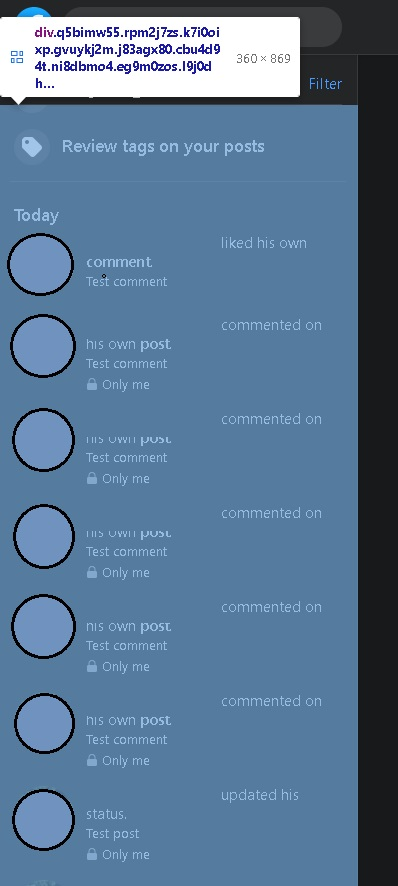

# If script didn't work - send me a messange or fix it yourself

## Start

1. Sign in.
2. Go to activity log.
3. Refresh page.
4. Open DevTool.
   > In chrome press F12.
5. Go to console.
6. Paste all code from **tools.js**
7. Clear console
   > CTRL + L
8. In console:

```
checkMyClass(classList)
```

where **classList** is your custom class list indicating the type of object you are looking for
e.q.

```
checkMyClass(SCROLL_AREA)

```

9. You will receive an array containing the items found. Move the mouse over the table elements - the browser will highlight them.
   Was this what you were looking for?

## Finding an up-to-date list of classes that indicate the type of object you're looking for

1. Sign in.
2. Go to activity log.
3. Refresh page.
4. Open DevTool.
   > In chrome press F12.
5. Turn on selecting an element in the page to inspect it.
   > In chrome press CTRL + SHIFT + C.
6. Select e.g. DELETE_BUTTON

   

7. Copy class list from selected element.
8. Paste all code from **tools.js** to console.
9. Clear console
   > CTRL + L
10. Run:

```
toolFindClass(myClassList)

```

11. You will receive an array of arrays containing the items found. Move the mouse over the nested array elements - the browser will highlight them.
    First element is name of class.
12. Combine one or more class, pointing only searched elements.
13. Check your result using **checkMyClass(classList)** function.
14. When you done, update your:

- OBJECT_ACTION
- DELETE_BUTTON
- SCROLL_AREA
- CONFIRM_LAYER

in appFacebookNew.js

**OBJECT_ACTION:**


**DELETE_BUTTON:**


(all of options have the same class list)

**CONFIRM_LAYER:**


(search confirm layer only when visible, script select first result - don't worry if other elements found - they can't be click())

**SCROLL_AREA:**


